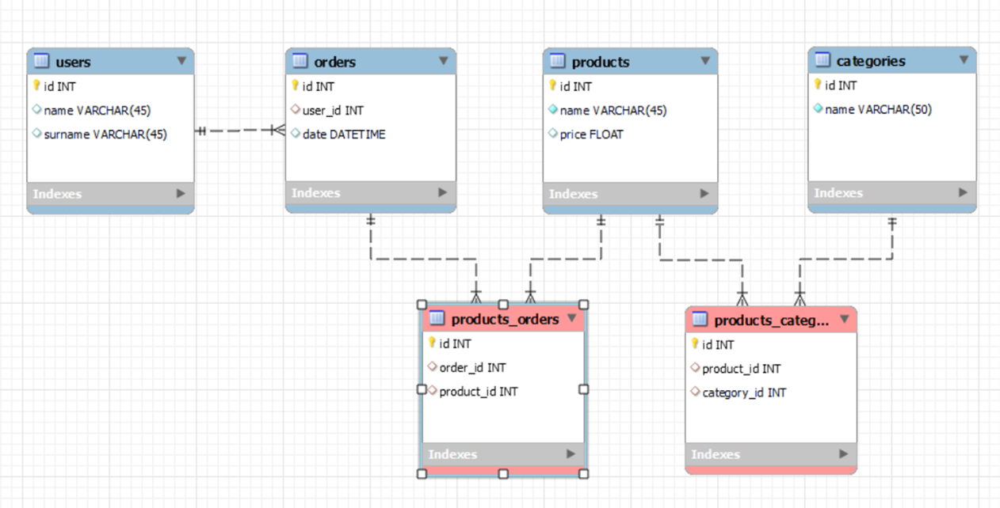

# PRACTICE of MySQL DATABASES

Creating, reading and manipulating a MySQL database using MySQL worbench.

Diagram:


# INSERT AND UPDATE

## 1. Insert 
>at least 
>* 5 users
>* 5 products
>* 5 orders
>* 2 categories 

```SQL
INSERT INTO users (name, surname) VALUES
	('Elvis', 'Presley'),
    ('Jim', 'Morrison'),
    ('Tina', 'Turner')
	('Luciano', 'Pavarotti')
    ('Nina', 'Simone');
		
INSERT INTO products (name, price) VALUES
	('Electric guitar', 599.50),
    ('Acoustic guitar', 345.00),
    ('Flute', Null),
    ('Hairspray', 69.99),
    ('Lipstick', 20.00),
    ('Cough drops', Null),
    ('Jack Daniels', 45.00)
    ('Energy bars', Null);
    
		
INSERT INTO categories (name) VALUES
	('Musical instruments'),
    ('Cosmetics'),
    ('Health'),
    ('Food and drink');

INSERT INTO orders (user_id) VALUES
	(5),
    (3),
    (2),
    (3),
    (5),
    (4);
```
__Note:__ Default didn't work from diagram, adding date default here. REASON: In mySQL, <b>a column must allow NULL values in order to set a default value!</b> <br>The following code replaces previously set not-null value:
```SQL
ALTER TABLE orders
	MODIFY date DATETIME DEFAULT CURRENT_TIMESTAMP;
```
__Note:__ Added dates for orders where they were missing due to the default error

```SQL
UPDATE orders SET date=now() WHERE id between 1 AND 4;
UPDATE orders SET date='2023-03-24 19:30:30' WHERE id=6;
```

## Adding products to categories (intermediary table links)
```SQL
INSERT INTO products_categories (product_id, category_id) VALUES
	(1, 1),
    (2, 1),
    (3, 1),
    (4, 2),
    (5, 2),
    (6, 3),
    (6, 4),
    (7, 4),
    (8, 3),
    (8, 4);
```
    
## Add products to orders (intermediary table links)

```SQL
INSERT INTO products_orders (order_id, product_id) VALUES
	(1, 3),
    (1, 4),
    (1, 7),
	(2, 7),
    (3, 1),
    (3, 8),
    (4, 5),
    (4, 6),
    (5, 3),
    (6, 6),
    (6, 7),
    (6, 8);
```

# MODIFYING PRODUCTS

## Change product name based on ID
```SQL
UPDATE products
SET name='Spanish guitar'
WHERE id=2;
```
## Change product price based on ID
```SQL
UPDATE products
SET price=50
WHERE id=3;
```

# VISUALISE!
```SQL
SELECT * FROM users;
SELECT * FROM products;
SELECT * FROM categories;
SELECT * FROM orders;
```

## Original data:

<b>USERS:</b>

| id | name    | surname   | 
|----|---------|-----------|
| 1  | Elvis   | Presley   |
| 2  | Jim     | Morrison  |
| 3  | Tina    | Turner    |
| 4  | Luciano | Pavarotti |
| 5  | Nina    | Simone    |

<b>ORIGINAL PRODUCT >>> UPDATED PRODUCTS:</b>

| id | name            | price | >>> | id | name            | price |
|----|-----------------|-------|---|----|-----------------|-------|
| 1  | Electric guitar | 599.5 | >>>| 1  | Electric guitar | 599.5 |
| 2  | Acoustic guitar | 345   | >>>| 2  | <b>Spanish guitar</b>  | 345   |
| 3  | Flute           | NULL  | >>> | 3  | Flute           | <b>50</b>   |
| 4  | Hairspray       | 69.99 | >>>| 4  | Hairspray       | 69.99 |
| 5  | Lipstick        | 20    | >>> | 5  | Lipstick        | 20    |
| 6  | Cough drops     | NULL  | >>> | 6  | Cough drops     | NULL  |
| 7  | Jack Daniels    | 45    | >>>| 7  | Jack Daniels    | 45    |
| 8  | Energy bars     | NULL  | >>>| 8  | Energy bars     | NULL  |

<b>CATEGORIES:</b>

| id | name                |
|----|---------------------|
| 1  | Musical instruments |
| 2  | Cosmetics           |
| 3  | Health              |
| 4  | Food and drink      |

<b>ORDERS:</b>

| id | user_id | date             |
|----|---------|------------------|
| 1  | 5       | 23/03/2023 17:21 |
| 2  | 3       | 23/03/2023 17:21 |
| 3  | 2       | 23/03/2023 17:21 |
| 4  | 3       | 23/03/2023 17:21 |
| 5  | 5       | 24/03/2023 18:22 |
| 6  | 4       | 24/03/2023 19:30 |


# OBTAINING DATA

## 1. Select products that cost more than 20
```SQL
SELECT * FROM products WHERE price > 20;
```
| PRICE OVER 20 |                 |       |
|---------------|-----------------|-------|
| id            | name            | price |
| 1             | Electric guitar | 599.5 |
| 2             | Spanish guitar  | 345   |
| 3             | Flute           | 50    |
| 4             | Hairspray       | 69.99 |
| 7             | Jack Daniels    | 45    |
---
## 2. View in descending order (ordered by name!)
```SQL
SELECT * FROM products ORDER BY name DESC;
```
| id | name            | price |
|----|-----------------|-------|
| 2  | Spanish guitar  | 345   |
| 5  | Lipstick        | 20    |
| 7  | Jack Daniels    | 45    |
| 4  | Hairspray       | 69.99 |
| 3  | Flute           | 50    |
| 8  | Energy bars     | NULL  |
| 1  | Electric guitar | 599.5 |
| 6  | Cough drops     | NULL  |
---
## 3. Show products with category
```SQL
SELECT
products.name,
GROUP_CONCAT(categories.name SEPARATOR '; ') AS categories
FROM products
LEFT JOIN products_categories ON products.id=products_categories.product_id
INNER JOIN categories ON categories.id=products_categories.category_id
GROUP BY products.name;
```
| name            | categories             |
|-----------------|------------------------|
| Cough drops     | Health; Food and drink |
| Electric guitar | Musical instruments    |
| Energy bars     | Health; Food and drink |
| Flute           | Musical instruments    |
| Hairspray       | Cosmetics              |
| Jack Daniels    | Food and drink         |
| Lipstick        | Cosmetics              |
| Spanish guitar  | Musical instruments    |
---

## 4. Show all users and their orders 
```SQL
SELECT
CONCAT(users.name, ' ', users.surname) AS client_full_name, orders.id AS order_id, GROUP_CONCAT(products.name SEPARATOR ', ') AS contains_products
FROM users
LEFT JOIN orders ON users.id=orders.user_id
LEFT JOIN products_orders ON orders.id=products_orders.order_id
INNER JOIN products ON products.id=products_orders.product_id
GROUP BY orders.id  -- THIS HERE allows several products to be written on the same line with the order. If you remove the GROUP BY clause, MySQL will not know how to group the results, and will return an error. 
ORDER BY users.name; --This orders the table by name
```
| client_full_name  | order_id | contains_products                      |
|-------------------|----------|----------------------------------------|
| Jim Morrison      | 3        | Electric guitar, Energy bars           |
| Luciano Pavarotti | 6        | Cough drops, Jack Daniels, Energy bars |
| Nina Simone       | 1        | Flute, Hairspray, Jack Daniels         |
| Nina Simone       | 5        | Flute                                  |
| Tina Turner       | 2        | Jack Daniels                           |
| Tina Turner       | 4        | Lipstick, Cough drops                  |

---

##  (My own exercise) Show all products with their id and show category
```SQL
SELECT
products.id AS product_id, products.name AS product, GROUP_CONCAT(categories.name SEPARATOR '; ') AS found_in_categories
FROM products
INNER JOIN products_categories ON products.id=products_categories.product_id
INNER JOIN categories ON categories.id=products_categories.category_id
GROUP BY products.id;
```
| product_id | product         | found_in_categories    |
|------------|-----------------|------------------------|
| 1          | Electric guitar | Musical instruments    |
| 2          | Spanish guitar  | Musical instruments    |
| 3          | Flute           | Musical instruments    |
| 4          | Hairspray       | Cosmetics              |
| 5          | Lipstick        | Cosmetics              |
| 6          | Cough drops     | Health; Food and drink |
| 7          | Jack Daniels    | Food and drink         |
| 8          | Energy bars     | Health; Food and drink |
---
 ## 5. Show one product with its id and show category

```SQL
SELECT
products.id AS product_id, products.name AS product, GROUP_CONCAT(categories.name SEPARATOR '; ') AS found_in_categories
FROM products
INNER JOIN products_categories ON products.id=products_categories.product_id
INNER JOIN categories ON categories.id=products_categories.category_id
WHERE products.id=8;
--IN THE ABOVE CODE, GROUP BY is not necessary because there is only one product. If we include it, WHERE-clause should go just above it.
```
| product_id | product     | found_in_categories    |
|------------|-------------|------------------------|
| 8          | Energy bars | Health; Food and drink |

---

## 6. Show one user and their orders
```SQL
SELECT
users.id AS user_id, CONCAT(users.name, ' ', users.surname) AS full_name, orders.id AS order_id, GROUP_CONCAT(products.name SEPARATOR ', ') AS contains_products
FROM users
INNER JOIN orders ON users.id=orders.user_id
INNER JOIN  products_orders ON orders.id=products_orders.order_id
INNER JOIN products ON products.id=products_orders.product_id
WHERE users.id=3
GROUP BY orders.id;
```
| user_id | full_name   | order_id | contains_products     |
|---------|-------------|----------|-----------------------|
| 3       | Tina Turner | 2        | Jack Daniels          |
| 3       | Tina Turner | 4        | Lipstick, Cough drops |

---
# Extra exercices 
## Delete a product by id

First deletion attempt failed.

```SQL
DELETE from products where id=2; -- Won't work because of FOREIGN KEY CONSTRAINT. Must delete from child tables before deleting from this table

SHOW CREATE TABLE products_categories; -- shows the table and its properties

-- The following code deletes the constricting foreign key, and adds it again, this time with "on delete cascade" command. The reference will get deleted when parent is deleted.

ALTER TABLE products_categories
DROP FOREIGN KEY `product_id_ibfk_2`;  -- BACKTICKS!

ALTER TABLE products_categories
ADD CONSTRAINT `product_id`  -- BACKTICKS!
FOREIGN KEY (`product_id`)  -- BACKTICKS!
REFERENCES products (`id`)   -- BACKTICKS!
ON DELETE CASCADE;

-- repeated for products_orders Table
```
After the above procedure, we can delete product 2.
```SQL
DELETE from products where id=2;
```
| id | name            | price |
|----|-----------------|-------|
| 1  | Electric guitar | 599.5 |
| 3  | Flute           | 50    |
| 4  | Hairspray       | 69.99 |
| 5  | Lipstick        | 20    |
| 6  | Cough drops     | NULL  |
| 7  | Jack Daniels    | 45    |
| 8  | Energy bars     | NULL  |
---
## Create a new table reviews with corresponding relationship 
(one-to-many with users and products)

```SQL
CREATE TABLE reviews(
   id INT AUTO_INCREMENT,
   product_id INT,
   user_id INT,
   rating VARCHAR(1),
   title VARCHAR(50),
   body TEXT,
   publish_date DATETIME DEFAULT CURRENT_TIMESTAMP,
   PRIMARY KEY(id),
   FOREIGN KEY (product_id) REFERENCES products(id) ON DELETE CASCADE,
   FOREIGN KEY (user_id) REFERENCES users(id) ON DELETE CASCADE
);
```

## Insert data into reviews

```SQL
INSERT INTO reviews (product_id, user_id, rating, title, body, publish_date) VALUES
	(3, 5, 5, 'Excellent sound', 'First-class flute for all your musical needs', default),
    (6, 4, 2, 'Bad taste', 'These sweets are effective but taste terrible', default),
    (6, 3, 4, 'Ok product', 'The quantity could be higher', default),
    (7, 3, 5, 'Perfect', null, default),
    (1, 2, 4, 'Would buy again', 'Great sound and won\'t break on impact', default); 
```
Escape character \ works correctly on MySQL workbench even though the above code displays it as incorrect (MD).

## Change a review
```SQL
UPDATE reviews
SET rating=1, title='Would not buy again', body='It broke on impact with amplifier', publish_date=default
WHERE id=5;
```


---
# Select all reviews 
```SQL
SELECT * from reviews;
```
Original:


| id | product_id | user_id | rating | title           | body                                          | publish_date     |
|----|------------|---------|--------|-----------------|-----------------------------------------------|------------------|
| 1  | 3          | 5       | 5      | Excellent sound | First-class flute for all your musical needs  | 26/03/2023 15:31 |
| 2  | 6          | 4       | 2      | Bad taste       | These sweets are effective but taste terrible | 26/03/2023 15:31 |
| 3  | 6          | 3       | 4      | Ok product      | The quantity could be higher                  | 26/03/2023 15:31 |
| 4  | 7          | 3       | 5      | Perfect         | NULL                                          | 26/03/2023 15:31 |
| 5  | 1          | 2       | 4      | Would buy again | Great sound and won't break on impact         | 26/03/2023 15:31 |

After changing review no 5

| 5 | 1 | 2 | 1 | Would not buy again | It broke on impact with amplifier | 26/03/2023 15:36 |
|---|---|---|---|---------------------|-----------------------------------|------------------|
---
# Select all the products with their corresponding reviews.
```SQL
SELECT 
products.id AS product_id, products.name, reviews.rating AS stars_given, reviews.title, reviews.body
FROM products
LEFT JOIN reviews ON products.id=reviews.product_id
ORDER BY products.id;
```
| product_id | name            | stars_given | title               | body                                          |
|------------|-----------------|-------------|---------------------|-----------------------------------------------|
| 1          | Electric guitar | 1           | Would not buy again | It broke on impact with amplifier             |
| 3          | Flute           | 5           | Excellent sound     | First-class flute for all your musical needs  |
| 4          | Hairspray       | NULL        | NULL                | NULL                                          |
| 5          | Lipstick        | NULL        | NULL                | NULL                                          |
| 6          | Cough drops     | 2           | Bad taste           | These sweets are effective but taste terrible |
| 6          | Cough drops     | 4           | Ok product          | The quantity could be higher                  |
| 7          | Jack Daniels    | 5           | Perfect             | NULL                                          |
| 8          | Energy bars     | NULL        | NULL                | NULL                                          |
---
# Show one product with reviews
```SQL
SELECT 
	products.id AS product_id, products.name, reviews.rating AS stars_given, reviews.title, reviews.body
	FROM products
	LEFT JOIN reviews ON products.id=reviews.product_id
    WHERE products.id=6
    ORDER BY products.id;
```

| product_id | name        | stars_given | title      | body                                          |
|------------|-------------|-------------|------------|-----------------------------------------------|
| 6          | Cough drops | 2           | Bad taste  | These sweets are effective but taste terrible |
| 6          | Cough drops | 4           | Ok product | The quantity could be higher                  |

---
# Show the products together with the category they belong to and the reviews
```SQL
SELECT 
products.id AS product_id, products.name,
GROUP_CONCAT(categories.name SEPARATOR '; ') AS found_in_categories, 
reviews.rating AS stars_given, CONCAT(reviews.title, ': ', reviews.body) AS review
FROM reviews
RIGHT JOIN products ON products.id=reviews.product_id
INNER JOIN products_categories ON products.id=products_categories.product_id
INNER JOIN categories ON categories.id=products_categories.category_id
GROUP BY products.id, products.name, reviews.rating,  reviews.title,  reviews.body; -- ONLY_FULL_GROUP_BY is enabled by default and requires that all columns in the SELECT clause that are not aggregated must also appear in the GROUP BY clause. Alternative is to disable the ONLY_FULL_GROUP_BY mode
```
| product_id | name            | found_in_categories    | stars_given | review                                                        |
|------------|-----------------|------------------------|-------------|---------------------------------------------------------------|
| 1          | Electric guitar | Musical instruments    | 1           | Would not buy again: It broke on impact with amplifier        |
| 3          | Flute           | Musical instruments    | 5           | Excellent sound: First-class flute for all your musical needs |
| 4          | Hairspray       | Cosmetics              | NULL        | NULL                                                          |
| 5          | Lipstick        | Cosmetics              | NULL        | NULL                                                          |
| 6          | Cough drops     | Health; Food and drink | 2           | Bad taste: These sweets are effective but taste terrible      |
| 6          | Cough drops     | Health; Food and drink | 4           | Ok product: The quantity could be higher                      |
| 7          | Jack Daniels    | Food and drink         | 5           | NULL                                                          |
| 8          | Energy bars     | Health; Food and drink | NULL        | NULL                                                          |


# Summary of findings 

## Foreign key

Foreign key causes some constraints, one of which is that a row cannot be deleted from the parent table because foreign key's default behaviour is set to ON DELETE RESTRICT.

Ways to get around this:

1. Go around your database and delete all children first.

2. Set foreign key to **ON DELETE CASCADE**. When parent is deleted, child references are automatically deleted.

3. Set foreign key to null **ON DELETE SET NULL**. The advantage is that past references will still be preserved (e.g. a product is deleted but the its purchase history will not disappear). However, this can result in orphans (child rows with no parent row) that cause problems. Further investigation needed.

4. Disable foreign key check. This method should be used with caution because disabling the foreign key check can allow you to violate referential integrity constraints.


To change an existing foreign key's on-delete behaviour, drop the key and then create it again with the correct specs:
```SQL
--DROP KEY:
ALTER TABLE child_table 
DROP FOREIGN KEY fk_constraint_name; --can be found by SHOW CREATE TABLE table_name

--CREATE ANEW:
ALTER TABLE child_table 
ADD CONSTRAINT fk_constraint_name 
FOREIGN KEY (child_column) -- the column in the child table that references parent 
REFERENCES parent_table (parent_column) 
ON DELETE CASCADE;
```

## GROUP BY

MySQL comes by default with mode ONLY_FULL_GROUP_BY , which requires that all columns in the SELECT clause that are not aggregated must also appear in the GROUP BY clause.
    
This will not work:
```SQL
SELECT 
products.id, --not aggregated
products.name, --not aggregated
GROUP_CONCAT(categories.name SEPARATOR '; '), --aggregated
reviews.rating, --not aggregated
reviews.title,  --not aggregated
reviews.body --not aggregated
FROM reviews
RIGHT JOIN products ON products.id=reviews.product_id
INNER JOIN products_categories ON products.id=products_categories.product_id
INNER JOIN categories ON categories.id=products_categories.category_id
GROUP BY products.id; -- HERE only one
```
Whereas this will:

```SQL
GROUP BY 
    products.id, 
    products.name, 
    reviews.rating,
    reviews.title,
    reviews.body;
```

Alternatively, we can modify disable the ONLY_FULL_GROUP_BY mode by running the following command before the query:

```SQL
SET sql_mode=(SELECT REPLACE(@@sql_mode,'ONLY_FULL_GROUP_BY',''));
```


    

	